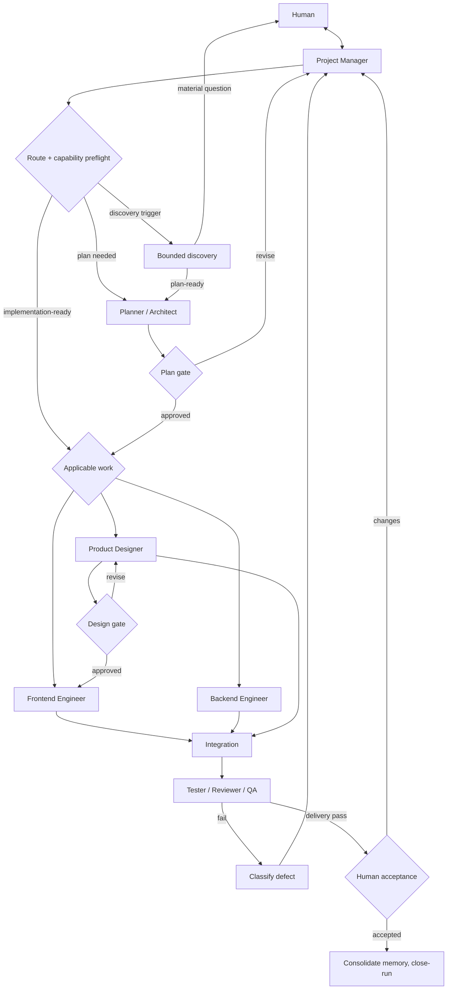
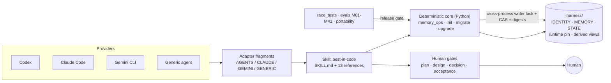

# Harness


Harness is an adaptive software-delivery skill for Codex, Claude Code, Gemini CLI, and filesystem-capable AI agents. One portable skill routes each task through quick, standard, or full delivery; coordinates seven logical role contracts; keeps durable, scoped project memory in plain files; defends research from prompt injection; applies evidence-based QA; and pauses only at real human gates.

Everything canonical lives in plain Markdown/JSON under `.harness/` — any model can resume the same project.

## Demo

One-shot project health report (`doctor`):

```json
{
  "ok": true,
  "operation": "doctor",
  "verdict": "HEALTHY",
  "failed_checks": [],
  "checks": [
    { "check": "identity-valid", "ok": true, "detail": "project-8a5f6dfd-…" },
    { "check": "store-valid", "ok": true, "revision": 0 },
    { "check": "views-fresh", "ok": true, "detail": "all derived views match canonical memory" },
    { "check": "runtime-pinned", "ok": true, "detail": "version=0.3.1" },
    { "check": "writer-lock-probe", "ok": true, "detail": "AVAILABLE" }
  ]
}
```

Real two-process race suite (spawns actual OS processes — contention is measured against a held lock):

```
[PASS] contender-times-out-against-held-lock: LOCK_TIMEOUT after 0.80s, mutation refused
[PASS] crash-orphan-recovery: victim died holding lock (exit 9); survivor committed in 0.22s
[PASS] lost-update-storm: 6/6 concurrent commits serialized, readers never saw torn JSON
[PASS] alias-fallback-gap: aliases converge to one canonical lock key via realpath
[PASS] exact-run-ownership: closed-run records never leak into later runs
```

Memory evaluation matrix — green on everything testable without a live model:

```
counts: {'PASS': 36, 'FAIL': 0, 'SKIP': 5}   (Windows)
counts: {'PASS': 37, 'FAIL': 0, 'SKIP': 4}   (Linux; M34 symlink case included)
```

## Quick start

```bash
# initialize a project (idempotent, never overwrites your AGENTS/CLAUDE/GEMINI files)
npx github:kingggg5/harness init --project . --models all

# health check anytime
npx github:kingggg5/harness doctor --project .

# memory operations
npx github:kingggg5/harness remember --scope project --kind fact --key formatter --value "ruff line-length 120"
npx github:kingggg5/harness recall --query formatter
npx github:kingggg5/harness close-run --run-id RUN-current-id

# quality gates
npx github:kingggg5/harness race        # two-process concurrency regression suite
npx github:kingggg5/harness evals       # M01-M41 memory evaluation matrix
npx github:kingggg5/harness portability # package structure gate
```

Requires Node 18+ (for the launcher) and Python 3.10+ (for the deterministic core). No npm registry needed — `npx github:kingggg5/harness` runs straight from this repository.

### Provider setup

| Provider | Install | Invoke |
|---|---|---|
| Codex | add `harness` from your configured marketplace | `$best-in-code <task>` |
| Claude Code | `claude --plugin-dir <harness-package>` or a Claude marketplace | `/harness:best-in-code <task>` |
| Gemini CLI | `gemini extensions link <harness-package>` | ask Gemini to use `best-in-code` |
| Generic agent | make the package readable, keep `adapters/project/AGENTS.md.fragment` importable | `Harness: <task>` |

Restart the provider session after installing so skill discovery reloads.

## Workflow

The delivery graph is canonical in [`skills/best-in-code/references/workflow-graph.md`](skills/best-in-code/references/workflow-graph.md); `STATE.json` is its machine-readable authority.



Run states live in `STATE.json`: `INTAKE → DISCOVERY → PLAN → DESIGN → BUILD → INTEGRATE → VERIFY → WAITING_ACCEPTANCE → DONE`, with `REWORK`, `WAITING_DECISION`, and `BLOCKED` as legal side-states. Task-scoped memory is bound to the exact `run_id` and dies with `close-run`.

## Architecture



Safety properties enforced by the core, not by prompts:

- **Cross-process writer lock** — byte-range lock with bounded wait; crash-orphan recovery needs no manual cleanup; path aliases converge to one lock.
- **CAS commits** — every write re-checks expected bytes before an atomic replace; transient Windows share violations retry instead of corrupting.
- **Digest-bound migration** — legacy migration applies only after a human approves the exact preview digest bound to input bytes, repository identity, adapter fragments, and runtime pin.
- **Exact run ownership** — task records require the current `run_id`; wrong ID is refused, `close-run` is idempotent, nothing leaks across runs.
- **Bounded everywhere** — recall budgets, store/caches/export sizes, source-read caps, clock-skew windows all have explicit ceilings.

## Agents and skills

**Skill:** `best-in-code` — invocation has two axes:

- Scale: `auto` (default), `quick`, `standard`, `full`. Explicit `full` is never downgraded.
- Operation: `start` (default), `resume`, `review` (read-only), `init`, direct memory commands (lightweight path).

Portable forms: `Harness: <task>`, `Harness full: <task>`, `Harness review`, `Harness resume`.

**Role contracts** (logical roles — any model can fill them; parallel when isolated, sequential labeled passes otherwise):

| Role | Contract |
|---|---|
| Project Manager | Routes work; the *only* writer of shared state and memory |
| Planner / Architect | Produces the plan through the plan gate |
| Researcher | Read-only evidence gathering; supports every phase |
| Product Designer | Design output through the design gate |
| Frontend / Backend Engineer | Bounded `ROLE-PACKET.md`: objective, verified record IDs, file ownership, stop condition |
| Tester / Reviewer / QA | Independent only when isolated from implementation context |

**Reference modules** loaded on demand: `workflow-graph`, `memory-loop`, `mode-routing`, `discovery-loop`, `research-routing`, `research-basis-2026`, `capability-contract`, `provider-adapters`, `engineering-standards`, `frontend-skill-routing`, `ux-laws-and-visual-discovery`, `shipproof-routing`, `harness-evaluation`.

**Agent manifests:** `.claude-plugin/plugin.json`, `.codex-plugin/plugin.json`, `gemini-extension.json`, and `agents/openai.yaml` (Codex policy: implicit invocation allowed).

## Memory command reference

All commands print JSON; `--project` defaults to `.`; task scope requires `--run-id` exactly matching `STATE.json`.

```text
memory_ops.py remember --scope project|task|global --kind fact|preference|decision|command|contract|risk --key K --value V
memory_ops.py correct <RECORD_ID> [--value V]      memory_ops.py forget <RECORD_ID>
memory_ops.py close-run --run-id R                 memory_ops.py recall --query "text" [--max-records N] [--max-bytes B]
memory_ops.py status | validate | render | export-cache --output PATH | doctor
```

## Safe migration and upgrades

```bash
python skills/best-in-code/scripts/migrate_project.py --project P --models all --dry-run --json
python skills/best-in-code/scripts/migrate_project.py --project P --models all --approve <sha256-from-preview>
```

- Refuses legacy/mixed schemas instead of half-upgrading; active runs, conflicts, unsafe rows stop for human review.
- Archives original inputs byte-for-byte under `.harness/migrations/`, maps legacy IDs in `MIGRATION.json`, rolls back on failure.
- The approval digest covers reviewed inputs + repository identity + adapter fragments + runtime pin — moving/forking the repo invalidates it.
- Runtime upgrades use the same preview→approve flow; prior pinned runtimes stay recoverable under `.harness/runtime-history/`.

## Development

```bash
python skills/best-in-code/scripts/validate_portability.py   # structure gate (12 groups)
python skills/best-in-code/scripts/race_tests.py             # two-process concurrency suite
python skills/best-in-code/scripts/run_memory_evals.py --json # M01-M41 matrix (36-37 PASS locally)
```

CI runs all three on Ubuntu and Windows. Eval cases M05/M06/M28/M31 require a live target model; M34 requires POSIX for symlink coverage. See [CHANGELOG.md](CHANGELOG.md).

## License

[MIT](LICENSE)
