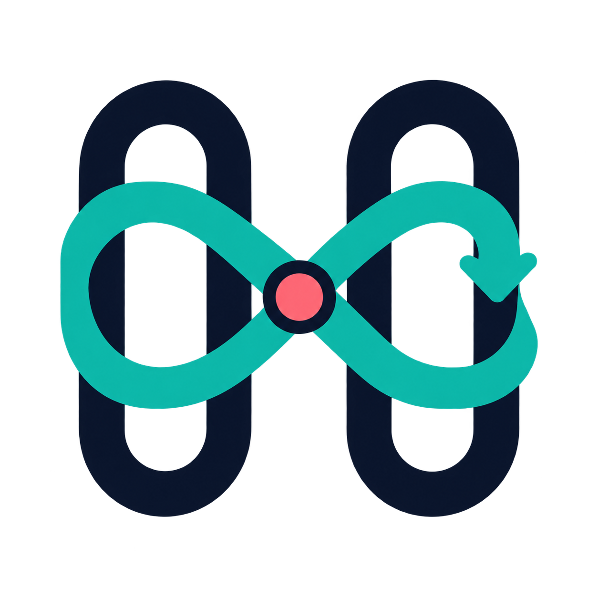
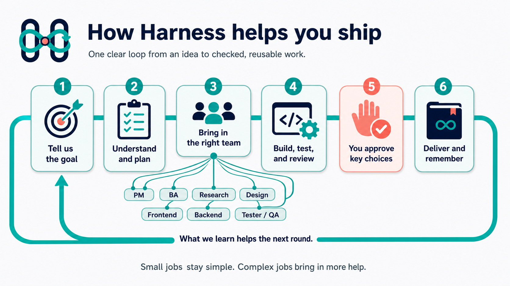
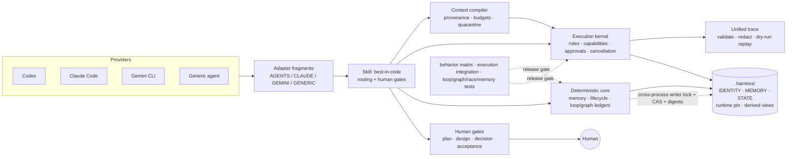

<p align="center">
	
</p>

# Harness

[](https://github.com/kingggg5/harness/actions/workflows/ci.yml)
[](https://github.com/kingggg5/harness/releases/latest)

Harness is a provider-neutral software-delivery system for Codex, Claude Code, Gemini CLI, and filesystem-capable AI agents. One portable skill routes each task through quick, standard, or full delivery; coordinates seven delivery roles plus a conditional Business Analyst pass; keeps durable scoped memory; compiles only relevant context; defends tool use and research from prompt injection; measures behavior; and pauses at real human gates.

Everything canonical lives in plain Markdown/JSON under `.harness/` — any model can resume the same project.

`MEMORY.json` is durable authority; `CONTEXT.md` is its generated readable knowledge view. Complex repositories may activate one optional source-grounded `PROJECT-MAP.md` for topology, glossary, ownership, and cross-system flows. It is not created by `init`; Harness activates it only when the map will be reused. Harness deliberately does not create a second generic `KNOWLEDGE.md`.

Complex runs may also compile an optional `TASK-GRAPH.json`: bounded jobs, real artifact dependencies, disjoint file ownership, one merge owner, evaluator limits, and human approval before expensive-to-undo actions. It is a run plan, never another memory or state authority.

Repeated, scheduled, or proactive work may add one optional `LOOP-CONTRACT.json`: trigger, observable outcome, deterministic-first verification, fixed budgets, rollback, evidence, and human gates. It is a supervisor envelope, not permission to run forever.

If that run must survive a process or session boundary, an optional local graph ledger records atomic claims, commit-scoped results, content-addressed artifacts, timeouts, and resume checks under `.harness/.cache/`. It is evidence and coordination state, not an autonomous executor or durable team-memory source.

When a reviewed plan needs an actual portable executor, the optional execution kernel runs a provider adapter behind a closed contract: model profiles, role graph, capability scopes, exact verifier commands, budgets, child-permission containment, action-bound human receipts, cancellation, crash guards, and a unified hash-chained trace. The bundled adapter is a deterministic protocol demo; real model access stays in a separately reviewed provider adapter.

<p align="center">
	
</p>

## Demo

One-shot project health report (`doctor`):

```json
{
  "ok": true,
  "operation": "doctor",
  "verdict": "HEALTHY",
  "failed_checks": [],
  "checks": [
    { "check": "identity-valid", "ok": true, "detail": "project-8a5f6dfd-…" },
    { "check": "store-valid", "ok": true, "revision": 0 },
    { "check": "views-fresh", "ok": true, "detail": "all derived views match canonical memory" },
    { "check": "runtime-pinned", "ok": true, "detail": "version=0.6.0" },
    { "check": "writer-lock-probe", "ok": true, "detail": "AVAILABLE" }
  ]
}
```

Real two-process race suite (spawns actual OS processes — contention is measured against a held lock):

```
[PASS] contender-times-out-against-held-lock: LOCK_TIMEOUT after 0.80s, mutation refused
[PASS] crash-orphan-recovery: victim died holding lock (exit 9); survivor committed in 0.22s
[PASS] lost-update-storm: 6/6 concurrent commits serialized, readers never saw torn JSON
[PASS] alias-fallback-gap: aliases converge to one canonical lock key via realpath
[PASS] exact-run-ownership: closed-run records never leak into later runs
```

Memory evaluation matrix — green on everything testable without a live model:

```
counts: {'PASS': 36, 'FAIL': 0, 'SKIP': 5}   (Windows)
counts: {'PASS': 37, 'FAIL': 0, 'SKIP': 4}   (Linux; M34 symlink case included)
```

## Quick start

```bash
# initialize a project (idempotent, never overwrites your AGENTS/CLAUDE/GEMINI files)
npx github:kingggg5/harness init --project . --models all

# health check anytime
npx github:kingggg5/harness doctor --project .

# memory operations
npx github:kingggg5/harness remember --scope project --kind fact --key formatter --value "ruff line-length 120"
npx github:kingggg5/harness recall --query formatter
npx github:kingggg5/harness close-run --run-id RUN-current-id

# quality gates
npx github:kingggg5/harness race        # two-process concurrency regression suite
npx github:kingggg5/harness evals       # M01-M41 memory evaluation matrix
npx github:kingggg5/harness portability # package structure gate
npx github:kingggg5/harness context-build --project . --task "Fix checkout race" --include src/checkout.ts
npx github:kingggg5/harness tools-validate --registry .harness/runtime/assets/templates/TOOL-REGISTRY.json --json
npx github:kingggg5/harness eval-matrix --suite .harness/runtime/assets/evals/BEHAVIOR-SUITE.json --variant full --json
npx github:kingggg5/harness loop-validate --contract .harness/LOOP-CONTRACT.json
npx github:kingggg5/harness loop-run status --project . --contract .harness/LOOP-CONTRACT.json
npx github:kingggg5/harness graph-validate --graph .harness/TASK-GRAPH.json
npx github:kingggg5/harness graph-run status --project . --graph .harness/TASK-GRAPH.json
```

Requires Node 18+ (for the launcher) and Python 3.12+ (for consistent symlink/junction defenses). The launcher resolves a canonical interpreter from absolute PATH entries; on locked-down hosts, set `HARNESS_PYTHON` to an absolute Python executable path. No npm registry needed — `npx github:kingggg5/harness` runs straight from this repository.

For a pinned install, download the versioned `.tgz` and `SHA256SUMS` from [GitHub Releases](https://github.com/kingggg5/harness/releases), verify the checksum, then run `npm install --global ./kingggg5-harness-<version>.tgz`.

### Provider setup

| Provider | Install | Invoke |
|---|---|---|
| Codex | add `harness` from your configured marketplace | `$best-in-code <task>` |
| Claude Code | `claude --plugin-dir <harness-package>` or a Claude marketplace | `/harness:best-in-code <task>` |
| Gemini CLI | `gemini extensions link <harness-package>` | ask Gemini to use `best-in-code` |
| Generic agent | make the package readable, keep `adapters/project/AGENTS.md.fragment` importable | `Harness: <task>` |

Restart the provider session after installing so skill discovery reloads.

### Common invocations

```text
Harness quick: fix this proven one-file regression
Harness standard: add this feature and verify it
Harness full with adaptive model routing: investigate this production-risk performance issue
Harness review
Harness resume
Harness remember project: API pagination uses cursors
Harness standard: map this multi-service repository for reusable cross-service planning
```

## Examples

Start with one small example instead of learning the whole system first:

| Example | What it demonstrates |
|---|---|
| [Quick bug fix](examples/quick-bug-fix.md) | The smallest safe route with focused verification |
| [Full product feature](examples/full-product-feature.md) | BA, planning, design, parallel build, QA, and human gates |
| [Cross-model handoff](examples/cross-model-handoff.md) | Start in one provider and resume or review in another |
| [Production review](examples/production-review.md) | Read-only security, performance, scale, and failure-path review |
| [Graph Engineering feature](examples/graph-engineering-feature.md) | Centralized fan-out/fan-in, bounded QA repair, and a human-gated effect |
| [Bounded performance loop](examples/loop-engineering-performance.md) | Goal, deterministic verifiers, budgets, rollback, evidence, and stop rules |
| [Executable agent graph](examples/executable-agent-graph.md) | Provider-neutral adapter, contained delegation, durable approval, cancellation, and trace |

See [all examples](examples/README.md) for the expected evidence and reusable prompt pattern.

## Workflow

The delivery graph is canonical in [`skills/best-in-code/references/workflow-graph.md`](skills/best-in-code/references/workflow-graph.md); `STATE.json` is its machine-readable authority. Shape of one run:

```text
Human ↔ Project Manager → route + capability preflight
  ├─ Bounded discovery ──┐
  ├─ Conditional BA → requirement baseline
  ├─ Planner/Architect → plan gate
  │                      ├─ Product Designer → design gate
  ├─ Frontend + Backend Engineers (parallel, disjoint file ownership)
  ├─ Integration → independent QA
  ├─ Human acceptance ───┘
  └─ Consolidate memory → close-run
```

Run states live in `STATE.json`: `INTAKE → DISCOVERY → PLAN → DESIGN → BUILD → INTEGRATE → VERIFY → WAITING_ACCEPTANCE → DONE`, with `REWORK`, `WAITING_DECISION`, and `BLOCKED` as legal side-states. Task-scoped memory is bound to the exact `run_id` and dies with `close-run`.

### Executable agent graph, when host orchestration is not enough

The execution kernel turns an approved role graph into a durable run without handing policy to the model. `RUN-CONTRACT.json` fixes the Project/Run identity, role-to-model profiles, allowed child edges, per-role tools, read/write scopes, exact verifier argv, timeouts, token/cost/external-call/trace budgets, and approval expiry. The adapter can only return a final message or select one of five kernel tools: bounded project read, atomic scoped write, registered verifier, human request, or contained delegation.

After a Harness task has an active Run ID, copy and edit the pinned templates:

```bash
cp .harness/runtime/assets/templates/RUN-CONTRACT.json .harness/RUN-CONTRACT.json
cp .harness/runtime/assets/templates/ADAPTER-ARGV.json .harness/ADAPTER-ARGV.json
npx github:kingggg5/harness run-validate --project . --contract .harness/RUN-CONTRACT.json --adapter-argv-file .harness/ADAPTER-ARGV.json --json
npx github:kingggg5/harness run --project . --contract .harness/RUN-CONTRACT.json --adapter-argv-file .harness/ADAPTER-ARGV.json --json
```

`WAITING_APPROVAL` means the kernel stopped safely. Review its exact action and artifact digest, then use `run-approve`; use `run-cancel` to stop cooperatively. A completed kernel run still waits for the normal human Acceptance Gate. See the [execution runtime guide](skills/best-in-code/references/execution-runtime.md), [context compiler](skills/best-in-code/references/context-compiler.md), and [behavior/trace guide](skills/best-in-code/references/eval-runtime.md).

For a portable Python adapter or verifier, start its argv with `@harness-python`; Harness resolves it to the interpreter that started the kernel. Any other executable must be an absolute path—bare PATH commands such as `python`, `python3`, or `node` are refused to prevent substitution from a project directory or changed PATH.

### Loop Engineering, only for repeated work

A reusable loop is more than “keep going”: it is a trigger plus an observable goal, reproducible baseline, excluded scope, deterministic evidence, and a finite stop policy. Harness supports four portable levels—`turn`, `goal`, `scheduled`, and `proactive`—but starts at the lowest level that solves the task. Before the first iteration, `LOOP-CONTRACT.json` fixes run count, iterations, elapsed time, tokens, cost, external calls, parallelism, failure/no-progress stops, scope, rollback commit, overlap/dedupe policy, architecture/consequential human gates, and separate progress/best/usage receipts.

Each iteration takes one attributable hypothesis through observe → change → verify → compare → record → decide. A judge model may score subjective quality only after deterministic checks and never authorizes a tool call. The validator proves only that the contract matches the closed structural policy. At execution time, the backend must resolve each `command_id` through a reviewed read-only verifier registry, re-authorize the capability, and meter every declared limit. Scheduled/proactive loops require a verified scheduling or event backend with pause/cancel and overlap controls; without one—or without reliable budget metering—Harness runs one bounded interactive iteration and returns a reusable handoff command.

Read the [Loop Engineering contract](skills/best-in-code/references/loop-engineering.md), validate the [starter contract](skills/best-in-code/assets/templates/LOOP-CONTRACT.json), or copy the [performance example](examples/loop-engineering-performance.md). The loop contract may wrap a task graph, but it never replaces lifecycle state, graph receipts, or durable memory.

### Durable loop supervision, only when needed

For a goal or scheduled loop that must survive a model/process restart, the bundled `loop-run` ledger pins the validated contract to the active Project/Run IDs and accepted Git commit. It deduplicates host deliveries, grants one ephemeral iteration lease, hashes current verifier/best evidence, records host-reported usage, applies fixed failure/no-progress/resource stops, and supports pause, cancel, and exact stale-lease recovery. Passing writing iterations must return an exact commit whose diff stays inside `control.write_scope`; only an accepted commit can seed the next iteration.

The ledger is deliberately not an autonomous agent platform: it does not schedule, launch or stop workers, execute verifier IDs, measure provider usage, modify source, or authorize an external effect. Those remain trusted host responsibilities, and scheduled/proactive work still stops at human gates. Read the [loop runtime guide](skills/best-in-code/references/loop-runtime.md) for `start`, `trigger`, `claim`, `finish`, `status`, `pause`, `resume`, `cancel`, and `recover`. Short interactive work skips the ledger.

### Graph Engineering, only when the work splits

Harness keeps sequential work with one owner. When two or more jobs are genuinely independent after a stable contract, Planner/Architect can compile a centralized diamond: split into disjoint workers, merge through one Project Manager, verify in a separate pass, and stop at a human node before a consequential effect. Every node has named input/output artifacts, repo-relative scopes, attempts, timeout, success criteria, and a hard graph budget; every repair loop has a maximum round count. A consequential node gets one attempt plus an idempotency key bound to the run and approved artifact.

This is conditional, not another permanent agent. Google Research's 2026 evaluation found large gains on a parallelizable task but 39–70% degradation across tested sequential planning configurations, so “more agents” is not the default. Read the [design and research basis](skills/best-in-code/references/graph-engineering.md) or copy the [working example](examples/graph-engineering-feature.md). No LangGraph, ADK, AutoGen, or other runtime is installed automatically.

### Durable graph receipts, only when needed

For a run that must resume after a process/session loss, the bundled `graph-run` ledger binds the approved graph to its exact Git baseline and active Project/Run IDs. Project Manager claims ready nodes with compare-and-swap revisions, gives each worker an ephemeral lease token, and accepts results only when required artifacts still match their SHA-256 receipts. Successful writing nodes must return an exact commit whose diff stays inside their declared `write_scope`.

A matching hash proves that bytes did not change; it does not prove that worker output is correct or safe. Project Manager still treats artifact contents as untrusted data and applies the destination node's schema, evidence, prompt-injection, and authorization checks.

`resume` re-verifies the graph digest, Git ancestry, source commits, and every current artifact. Timed-out claims can be requeued, failed, or blocked, but recovery never stops a process, deletes a worktree, or cleans files. Use the [graph runtime guide](skills/best-in-code/references/graph-runtime.md) for `start`, `claim`, `finish`, `status`, `resume`, and `recover`. Short sequential work keeps the static graph or skips it entirely.

### Isolated execution and long-running work

Concurrent writers never share one mutable checkout: each uses a verified provider workspace or Git worktree created from the graph's exact base commit, while Project Manager alone integrates. Worktrees isolate checked-out files but not ports, databases, caches, credentials, processes, or external services, so those resources are named separately or the nodes run sequentially.

An “overnight” request is still bounded before it starts: fixed objective and verification, iteration/time/token/cost/external-call ceilings, three-failure and two-cycle no-progress stops, status receipts, stall detection, cancellation, and clean-worktree preservation. Workers cannot push, merge, deploy, publish, or force-clean on their own. See [execution isolation and supervision](skills/best-in-code/references/execution-isolation.md). Firstmate, Treehouse, GNHF, and No-Mistakes are optional reviewed backends, not Harness dependencies.

## Architecture



Safety properties enforced by the core, not by prompts:

- **Cross-process writer lock** — byte-range lock with bounded wait; crash-orphan recovery needs no manual cleanup; path aliases converge to one lock.
- **CAS commits** — every write re-checks expected bytes before an atomic replace; transient Windows share violations retry instead of corrupting.
- **Digest-bound migration** — legacy migration applies only after a human approves the exact preview digest bound to input bytes, repository identity, adapter fragments, and runtime pin.
- **Exact run ownership** — task records require the current `run_id`; wrong ID is refused, `close-run` is idempotent, nothing leaks across runs.
- **Bounded everywhere** — recall budgets, canonical store/caches/exports, source reads, clock skew, and generated Markdown projections all have explicit ceilings.
- **Fail-closed recall identity** — a changed Git root/remote or logical scope blocks recall as well as writes until a human reviews an identity rebind.
- **Isolated concurrent writers** — one exact base revision and one verified workspace/branch per writer; shared runtime resources remain explicit and one Project Manager owns integration.
- **Bounded long runs** — iteration/time/token/cost/failure limits, progress receipts, cancellation and stall/no-progress terminal states are declared before dispatch.
- **Validated loop contracts** — level/trigger, baseline/exclusions, deterministic verifier, run/iteration/resource budgets, dedupe/overlap, rollback, distinct progress/best/usage evidence, scope, and architecture/consequential human gates fail closed before repeated work.
- **Durable loop receipts** — immutable contract digest, delivery dedupe, one lease, event hash chain, accepted Git baseline/write scope, current evidence digests, usage and timeout/no-progress stops are enforced by the optional local supervisor ledger.
- **Content-addressed graph receipts** — graph digest, node lease, exact commit ancestry, write scope, artifact SHA-256, loop/attempt limits, and stale-claim recovery are checked by the optional local runtime.
- **Capability-bounded execution** — models select only declared tools; exact scopes, verifier argv, environment allowlists, budgets, role edges, and child capability subsets are enforced outside the model.
- **Action-bound human receipts** — approval records bind Project/Run/agent/tool/action, request bytes, artifact digest, idempotency key, actor, decision, and expiry; byte tampering fails closed.
- **Crash-aware side effects** — outstanding model calls are never guessed or silently replayed, completed atomic writes recover only by exact artifact digest, and indeterminate commands stop the run.
- **Provenance-rich context** — selected inputs are bounded and content-addressed; high-confidence prompt injection in untrusted sources is quarantined and cannot authorize tools.
- **Behavior and trace evidence** — full/single-owner/ablation trials report policy, routing, retention, latency, token, cost, retry, and context metrics; trace replay is evidence-only and never executes actions.
- **Verifiable releases** — CI pins third-party actions to commits; releases include SPDX SBOM, checksums, package provenance, and SBOM attestations.

## Agents and skills

**Skill:** `best-in-code` — invocation has two axes:

- Scale: `auto` (default), `quick`, `standard`, `full`. Explicit `full` is never downgraded.
- Operation: `start` (default), `resume`, `review` (read-only), `init`, direct memory commands (lightweight path).

Portable forms: `Harness: <task>`, `Harness full: <task>`, `Harness review`, `Harness resume`.

**Role contracts** (logical roles — any model can fill them; parallel when isolated, sequential labeled passes otherwise):

| Role | Contract |
|---|---|
| Project Manager | Routes work; the *only* writer of shared state, memory, and optional graph runtime ledger |
| Business Analyst (conditional pass) | Clarifies outcome, actors, scope, rules, questions, and acceptance behavior; never invents stakeholder intent or chooses architecture |
| Planner / Architect | Produces the plan through the plan gate |
| Researcher | Read-only evidence gathering; supports every phase |
| Product Designer | Design output through the design gate |
| Frontend / Backend Engineer | Bounded `ROLE-PACKET.md`: objective, verified record IDs, file ownership, stop condition |
| Tester / Reviewer / QA | Independent only when isolated from implementation context |

The BA pass is folded into PM for quick work, activated only when requirements are materially unclear, and skipped for implementation-ready tasks. It adds no workflow state or human gate.

### Model routing

Harness routes model **profiles**, then binds them to models available in the active provider:

| Profile | Typical work | OpenAI GPT-5.6 example |
|---|---|---|
| `reasoning` | Material planning/architecture, difficult investigation, high-risk or deep review | `gpt-5.6-sol` |
| `balanced` | Standard implementation, integration, and ordinary QA | `gpt-5.6-terra` |
| `fast` | Stable low-risk shards, fixtures, docs, and bounded extraction | `gpt-5.6-luna` |

Quick normally avoids switching. Standard defaults to `balanced` and escalates only material planning/review. Full uses `reasoning` for plan/high-risk review, `balanced` for implementation, and `fast` only after contracts and file ownership are stable. A user-pinned model wins. Missing selection support falls back to the current model with labeled passes; Harness never claims a switch from the request alone. See [official OpenAI model guidance](https://developers.openai.com/api/docs/models).

**Reference modules** loaded on demand: `workflow-graph`, `loop-engineering`, `loop-runtime`, `graph-engineering`, `graph-runtime`, `execution-isolation`, `memory-loop`, `mode-routing`, `model-routing`, `requirements-analysis`, `discovery-loop`, `research-routing`, `research-basis-2026`, `capability-contract`, `provider-adapters`, `engineering-standards`, `frontend-skill-routing`, `ux-laws-and-visual-discovery`, `shipproof-routing`, `harness-evaluation`.

Optional tools are capability backends, not dependencies. Harness uses an existing trusted backend only when its lane is active and never auto-installs one:

| Need | Candidate backends |
|---|---|
| Current library/API documentation | Context7 → official versioned docs/repository |
| Repository and current-web evidence | GitHub, Exa, official sources; Reddit/community sources are secondary evidence only |
| UI/UX and motion | design-taste, Impeccable, UI UX Pro Max, transitions.dev; Pinterest is read-only inspiration; Caveman is opt-in |
| Semantic recall | MemPalace over a sanitized project-scoped export; canonical files remain authority |
| Repository-native specifications | Existing convention, then optional OpenSpec or GitHub Spec Kit; never both as the same source of truth |
| Static/runtime evidence | ShipProof or repository checks; unavailable evidence is reported `Not verified` |
| Isolated writers/long runs | Native Git/provider workspace and bounded Harness loop first; Treehouse, GNHF, No-Mistakes, or Firstmate only after explicit review |

**Agent manifests:** `.claude-plugin/plugin.json`, `.codex-plugin/plugin.json`, `gemini-extension.json`, and `agents/openai.yaml` (Codex policy: implicit invocation allowed).

## Memory command reference

All commands print JSON; `--project` defaults to `.`; task scope requires `--run-id` exactly matching `STATE.json`.

```text
memory_ops.py remember --scope project|task|global --kind fact|preference|decision|command|contract|risk --key K --value V
memory_ops.py correct <RECORD_ID> [--value V]      memory_ops.py forget <RECORD_ID>
memory_ops.py close-run --run-id R                 memory_ops.py recall --query "text" [--max-records N] [--max-bytes B]
memory_ops.py status | validate | render | export-cache --output PATH | doctor
```

## Safe migration and upgrades

```bash
python skills/best-in-code/scripts/migrate_project.py --project P --models all --dry-run --json
python skills/best-in-code/scripts/migrate_project.py --project P --models all --approve <sha256-from-preview>
python skills/best-in-code/scripts/init_project.py --project P --rebind-identity --dry-run --json
python skills/best-in-code/scripts/init_project.py --project P --rebind-identity --approve <sha256-from-preview> --json
python skills/best-in-code/scripts/upgrade_project.py --project P --models all --dry-run --json
python skills/best-in-code/scripts/upgrade_project.py --project P --models all --approve <sha256-from-preview> --json
```

- Refuses legacy/mixed schemas instead of half-upgrading; active runs, conflicts, unsafe rows stop for human review.
- Archives original inputs byte-for-byte under `.harness/migrations/`, maps legacy IDs in `MIGRATION.json`, rolls back on failure.
- The approval digest covers reviewed inputs + repository identity + adapter fragments + runtime pin — moving/forking the repo invalidates it.
- Runtime upgrades use the same preview→approve flow; prior pinned runtimes stay recoverable under `.harness/runtime-history/`.
- Updating the installed plugin and opening a new provider session reloads plugin discovery. A project with `.harness/runtime/` remains pinned until its separately reviewed `upgrade_project.py` plan is approved.
- `--rebind-identity` preserves the Project ID and is only for the same logical project. A true fork needs an externally archived old `.harness/` followed by a fresh initialization and new Project ID.
- Run init/migrate/upgrade from a trusted full Harness package (or the `npx` launcher). The project-pinned runtime is self-contained for workflow policy and `memory_ops.py`, but intentionally does not duplicate package manifests and provider adapter sources required by lifecycle commands.

## Common recovery

| Symptom | Safe next action |
|---|---|
| Legacy or mixed schema | Run migration `--dry-run`; review and approve its exact digest |
| Repository identity mismatch | Inspect the root/remote/scope; use preview-bound rebind only for the same logical project |
| Unfinished run | Use `Harness resume` or close the exact Run ID; never silently replace it |
| Scheduled loop cannot start | Verify the scheduler/event capability; otherwise run one bounded interactive iteration and use its handoff command |
| Loop contract is rejected | Fix the reported trigger/verifier/budget/scope/rollback/gate field; never delete a limit just to start |
| Loop receipt will not resume | Inspect contract/identity/Git/evidence drift; restore or supersede deliberately, never edit the ledger or event chain |
| Graph receipt will not resume | Inspect the reported graph/identity/Git/artifact mismatch; restore or supersede evidence deliberately, never edit the ledger |
| Optional backend unavailable | Use the documented fallback and report reduced or `Not verified` evidence |

## Development

```bash
python skills/best-in-code/scripts/validate_portability.py   # structure gate (13 groups)
python skills/best-in-code/scripts/execution_runtime_tests.py # adapter/approval/delegation/cancel/tamper integration
python skills/best-in-code/scripts/context_eval_trace_tests.py # context/tool/eval/trace regression suite
python skills/best-in-code/scripts/doctor_runtime_tests.py    # exact runtime-pin drift detection
python skills/best-in-code/scripts/loop_tests.py             # loop-contract invariant suite
python skills/best-in-code/scripts/loop_runtime_tests.py     # trigger/lease/evidence/budget/Git integration
python skills/best-in-code/scripts/graph_tests.py            # static graph invariant suite
python skills/best-in-code/scripts/graph_runtime_tests.py    # real Git/claim/artifact/resume integration
python skills/best-in-code/scripts/race_tests.py             # two-process concurrency suite
python skills/best-in-code/scripts/run_memory_evals.py --json # M01-M41 matrix (36-37 PASS locally)
python scripts/check_workflow_policy.py                       # pinned actions + release attestations
npm run test:sbom                                            # SPDX generator regression suite
```

CI runs all deterministic suites on Ubuntu and Windows. Eval cases M05/M06/M28/M31 require a live target model; M34 requires POSIX for symlink coverage. See [CHANGELOG.md](CHANGELOG.md).

## License

[MIT](LICENSE)
