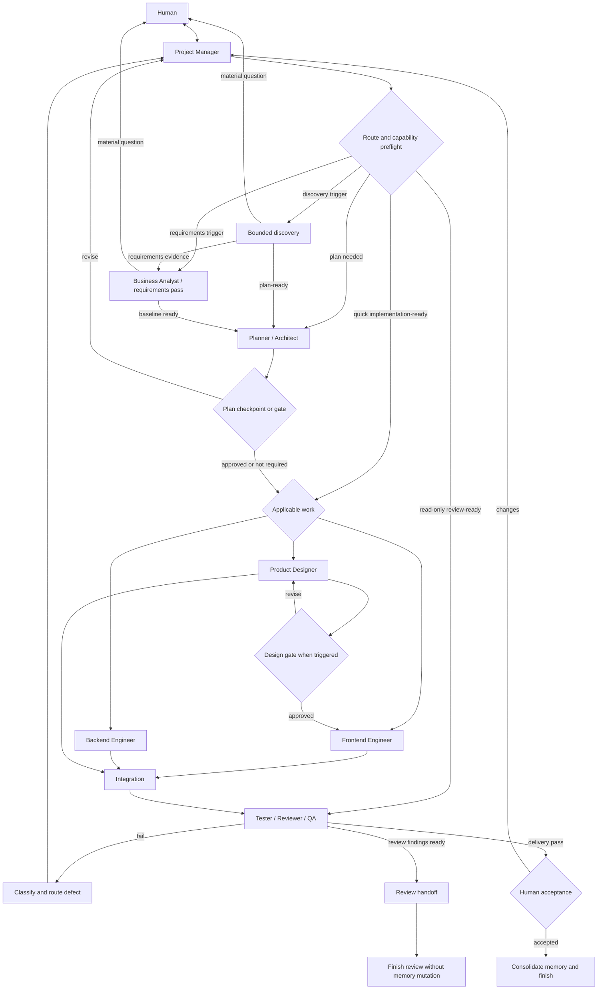

# Workflow Graph

This is the only canonical delivery graph and transition policy. `STATE.json` is the machine-readable state authority. `WORKFLOW.md` records the human-readable run contract and checkpoint evidence without copying this graph.

## Canonical graph

Researcher supports requirements analysis, discovery, planning, design, and verification as a read-only evidence role. The Business Analyst pass runs inside `INTAKE` or `PLAN`; it adds no state or gate. Inactive roles and passes are `N/A`; do not create work merely to exercise all seven delivery roles or the conditional pass.

## Optional per-run task graph

The macro graph above remains canonical. For a run with real independent branches, fan-in, a bounded evaluator loop, or a consequential effect, Planner/Architect may compile the optional `.harness/TASK-GRAPH.json` described in [graph-engineering.md](graph-engineering.md). The graph file is a run-scoped scheduling contract, not another lifecycle authority: Project Manager still advances `STATE.json`, owns merge and gates, and records only macro checkpoints in `WORKFLOW.md`. When session-resilient node receipts are justified, the optional local [graph runtime ledger](graph-runtime.md) records task-level execution under `.harness/.cache/` without replacing those authorities.

Draw an edge only when the target consumes a named source artifact or a real control decision. Keep sequential work with one owner; parallel workers require disjoint write scopes and a stable interface; one merge owner integrates their outputs. Every loop and fan-out is bounded before execution. A provider without isolated agents executes the same contract as labeled sequential passes.

For concurrent writers, context isolation alone is insufficient. Apply [execution-isolation.md](execution-isolation.md): start each worker from the graph's exact base revision in a separate verified workspace, isolate mutable runtime resources, return a commit/evidence receipt, and let Project Manager alone integrate and clean up. Long-running nodes also require observable status, cancellation, stall detection, and fixed iteration/time/token/cost limits.

## States and legal transitions

Allowed states are `INTAKE`, `DISCOVERY`, `PLAN`, `WAITING_PLAN`, `DESIGN`, `WAITING_DESIGN`, `BUILD`, `INTEGRATE`, `VERIFY`, `REWORK`, `WAITING_DECISION`, `WAITING_ACCEPTANCE`, `DONE`, and `BLOCKED`.

| From | Allowed next states |
|---|---|
| INTAKE | DISCOVERY, PLAN, BUILD, VERIFY, WAITING_DECISION, BLOCKED |
| DISCOVERY | DISCOVERY, PLAN, WAITING_DECISION, BLOCKED |
| PLAN | WAITING_PLAN, DESIGN, BUILD, VERIFY, WAITING_DECISION |
| WAITING_PLAN | PLAN, DESIGN, BUILD, BLOCKED |
| DESIGN | WAITING_DESIGN, BUILD, WAITING_DECISION |
| WAITING_DESIGN | DESIGN, BUILD, BLOCKED |
| BUILD | INTEGRATE, VERIFY, REWORK, WAITING_DECISION, BLOCKED |
| INTEGRATE | VERIFY, REWORK, BLOCKED |
| VERIFY | REWORK, WAITING_ACCEPTANCE, DONE (read-only review only), BLOCKED |
| REWORK | DISCOVERY, PLAN, DESIGN, BUILD, INTEGRATE, VERIFY, WAITING_DECISION, BLOCKED |
| WAITING_DECISION | DISCOVERY, PLAN, DESIGN, BUILD, VERIFY, BLOCKED |
| WAITING_ACCEPTANCE | REWORK, DONE, BLOCKED |
| BLOCKED | DISCOVERY, PLAN, DESIGN, BUILD, VERIFY, WAITING_DECISION |
| DONE | INTAKE |

Reject any other transition. A resume must restore exactly one `next_action`; if more than one action appears active, normalize at a human checkpoint.

`VERIFY -> DONE` is legal only for an explicit read-only review after its findings handoff. It performs no Acceptance Gate, implementation, stateful external action, or durable-memory consolidation. Delivery runs must use `VERIFY -> WAITING_ACCEPTANCE -> DONE`.

## Role contracts

| Role | Responsibility | Default boundary |
|---|---|---|
| Project Manager | Scope, routing, state, ownership, gates, integration, memory, handoff | Sole shared-state writer |
| Business Analyst (conditional pass) | Business outcome, actors, scope, rules, assumptions/questions, acceptance behavior, and shared vocabulary | Read-only; returns a requirement baseline and never invents stakeholder intent |
| Planner / Architect | System map, contracts, tasks, dependencies, rollout, measurable DoD | Read-only until approval |
| Researcher | Repository and external evidence, provenance, injection screening, unknowns | Read-only |
| Product Designer | User outcome, flows, hierarchy, states, tokens, accessibility, motion and reference contract | Approved design scope |
| Frontend Engineer | Client behavior, accessibility, responsive UI, data integration, frontend tests and budgets | Assigned client files |
| Backend Engineer | APIs, domain logic, data, validation, authorization, concurrency, observability and tests | Assigned server/data files |
| Tester / Reviewer / QA | Acceptance matrix, negative/boundary cases, final diff, regression and risk verification | Read-only; isolated when claimed independent |

Roles are contracts, not processes. Map them to isolated agents, sequential isolated sessions, or labeled same-agent passes using [capability-contract.md](capability-contract.md). The Business Analyst pass is not a mandatory eighth agent. A same-context pass can verify work but is never called independent.

## Role packet and ownership

Create a packet from `assets/templates/ROLE-PACKET.md` for each active parallel/material role. A quick same-agent pass may keep the same required fields as one inline workflow-ledger row instead of creating a separate file. Every packet includes objective, exclusions, verified memory IDs, inputs, owned files or read-only scope, capability/permission limits, required evidence, checks, stop condition, and expected next state. Give semantic-memory results only after canonical ID/source verification; never forward raw retrieval dumps.

The Project Manager serializes overlapping file ownership. Frontend and backend may run in parallel only after their interface contract is stable. Designer may support implementation but does not silently rewrite an approved direction. QA does not repair production code during its verification pass.

## Failure routing

Classify before retrying: requirement, discovery, plan/contract, design contract, implementation, test expectation, environment/capability, performance budget, or scale evidence. Preserve the same workload and threshold when repairing performance failures. Never weaken a valid assertion or label unavailable evidence as a pass.

Discovery stops after two consecutive cycles add no material evidence. The same blocker surviving three evidence-based attempts becomes `BLOCKED` or `WAITING_DECISION`; record attempted fixes and ask the human rather than retrying blindly.

## Checkpoint writes

The Project Manager updates `STATE.json` and the current workflow only at intake, plan/gate, integration, verification, blocker, and completion. Use optimistic memory revisions from [memory-loop.md](memory-loop.md). Role agents return structured packets and do not concurrently edit `.harness/`.
